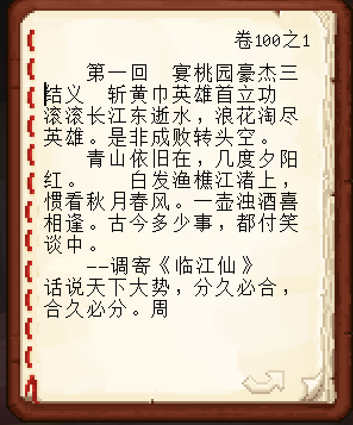
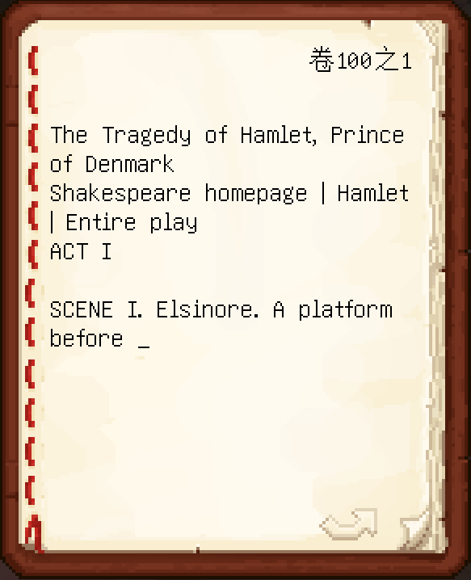

# Minecraft Auto Writing Book Script

## What is this?

This is a script to make writing books in Minecraft easier.

And it supports CJK characters.





## Usage

Just paste your text in the "text.txt" and open a "Book and Quill" in Minecraft.

```python
python main.py
```

And then you can see a countdown, please get back to Minecraft before the countdown ends.

```
3
2
1
Begin!
```

## Compatibility

Only tested on Windows, and it may only support Windows I think.

A Minecraft book in Java Edition can write up to 100 pages long, but the exact characters you can write in one page depend on the length, so I used the averge number `255`(according to the Chinese Minecraft Wiki from Fandom), you can change it to the number you want if you are sure it will not go wrong.

You may **not** paste too much text into the txt file, because there is an up limit in Minecraft. The example I gave is bad, it is the original version of *Romance of Three Kingdoms*, it has more than 1,000,000 Chinese characters, you may change it to something shorter.